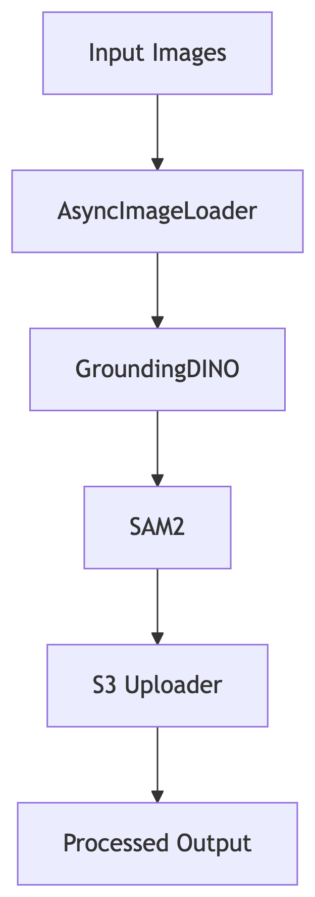

# Segmentation Pipeline using Grounding Dino and SAM

SAM does not come with zero shot object detection by default and needs bounding with/without input points. WE leverage Grounding Dino for getting these bounding boxes and then prompt SAM with those boxes. The segmentation is done at scale, processing about 100,000 images. We use thesholding to discard masks of lower scores. The resulting psuedo annotations are stored on s3 at treetracker-training-images/production_psuedo_labelling_100000/

This provides us sufficient data to train a custom [AutoSAM2](https://github.com/NeelGahalot/autosam-2). Details of the training run can be found on s3 as well - sagemaker-segmentation-neel/sam2_dino_psuedo_annotation_pipeline/

## Pipeline Architecture
<p align="center">
  
</p>
The pipeline consists of several key components:

- **AsyncImageLoader**: Downloads images asynchronously from URLs  
- **GroundingDINO**: Detects plants in images using zero-shot object detection  
- **SAM2**: Creates high-quality segmentation masks for detected plants  
- **S3 Uploader**: Uploads processed images and masks to S3

## Stratified Sampling from a Large-Scale Image Dataset
#  Background

The production image dataset consists of over 15 million images, hosted behind a REST API. Due to the size of the dataset, it is not feasible to load all data at once, so we access it using offset-based pagination through API queries. Each API call retrieves metadata—including the image_url—for a small number of samples.

How Image URLs Are Accessed
Each image is associated with a numeric offset, and is fetched using the following query pattern:
```json
{
  "trees": [
    {
      "image_url": "https://bucket.storage.com/images/img1234.jpg",
      "label": "banana"
    }
  ]
}
```

The 100,000 images processed to a csv file make use of startified sampling to ensure that we have far representation of the production. One can use the stratified sampling file to obtain a fair sampling.

## Exif Tag, Orientation and Automatic Rotations
THe Orientation key in the exif tags with certain values 3,6, and 8 (I think) can cause automatic rotations; your dataset may contain inconsistent rotations, leading to noisy training data and poor performance. Refer to the the exif python files that can  take care of this and would be a worthwhile addition to the pipeline. For the curent procesing however, I did not encounter any random rotations. 
